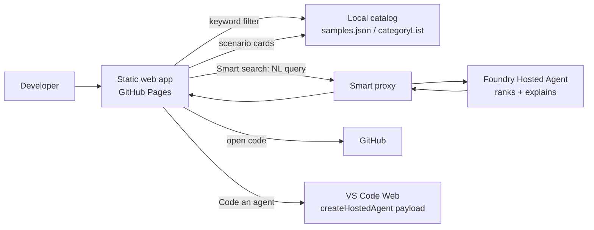

# Agents at Work: Foundry Platform Hackathon — Project One-Pager

| | |
|---|---|
| **Project Name** | Foundry Hosted-Agent Sample Finder |
| **Team Members** | Jason Zhu, Zhen Jiao, Junjie Li, Jaeyong Lee |
| **Primary Contact** | Jason Zhu |
| **Submission Date** | July 19, 2026 |

---

## 1. Project Summary

**What did you build?**

A zero-build, static web app that turns Microsoft Foundry's 60+ hosted-agent samples into a single guided finder. Instead of scrolling a flat, alphabetical list of jargon-named folders, developers land on one page — *"What should your hosted agent do?"* — and find the right sample three complementary ways, all on the same screen:

- **Keyword search** — instant, offline filtering across the whole catalog.
- **Scenario cards** — browse by what the agent *does* (basics, tools, knowledge, human-in-the-loop, orchestration, voice, governance…), then drill into matching samples.
- **Smart search** — describe your goal in plain language; a **Foundry hosted agent** reasons over the catalog and returns ranked matches, each with a short "why this fits" and a ★ Recommended top pick. Results render inline in the main window.

Every result links straight to the code and offers one-click next actions (open on GitHub, open in VS Code Web, or view the code dialog). There are no dead ends — users only ever see scenarios backed by real samples.

**Problem solved**

Foundry ships 60+ hosted-agent samples in a single folder of the `foundry-samples` repo, and the VS Code extension surfaces them as a flat, alphabetical wall of near-identical, jargon-heavy names (`byo-inv-ag-ui`, `af-resp-basic`, `langgraph-invocations-hitl`…). For a non-expert, there's no signal about where to start, how samples relate, or what's even available (folder READMEs are partly stale). The result is classic choice overload: newcomers pick the wrong starting point or abandon the gallery — the artifacts meant to *accelerate* adoption become a barrier to it. This project makes the catalog's hidden structure explicit and navigable, turning an overwhelming list into a short, plain-language conversation.

**Target user or audience**

Engineers and PMs new to Foundry hosted agents — anyone evaluating the platform or looking for a runnable "hello world" or a specific capability sample without prior knowledge of the naming scheme.

---

## 2. Challenge Alignment

**Select all challenge(s) supported:**

- [x] **Make It Effortless: Design for Product Simplicity**
- [ ] EngThrive 15/30 Challenge
- [ ] Unlock Intelligence with Microsoft IQs
- [x] **Build on Foundry Agents Platform**
- [ ] Make the Basics Fast: AI-First Engineering
- [ ] Hybrid Agents - Best of Edge + Cloud
- [ ] No specific challenge

**How the solution aligns**

- *Make It Effortless / Product Simplicity:* The core value is reducing choice overload — collapsing a 60-item wall into one guided page with a safe default (★ Recommended) at every step. It's a direct bet on simplicity as the adoption lever.
- *Build on Foundry Agents Platform:* The Smart search experience is powered by a deployed Foundry **hosted agent** that interprets natural-language intent and ranks samples with reasons — dogfooding the very platform the samples teach.

---

## 3. Foundry Platform Usage

**Relevant Foundry area(s)**

- [x] **Agents Platform**
- [x] **Hosted Agents**
- [ ] Prompt Agents
- [ ] Skills
- [ ] Toolboxes
- [ ] Routines
- [ ] Tracing / Observability
- [ ] Optimization / Evaluation
- [ ] Voice
- [ ] Multi-Agent Orchestration
- [x] **Other:** Foundry extension for GitHub Copilot App

**Key features used**

- A **Foundry hosted agent** (container-based, deployed via `azd ai agent`) backs Smart search: it receives the user's free-text query and returns structured `{ matches: [{id, why}], understood: [] }` JSON used to rank and annotate sample cards.
- **Foundry extension for GitHub Copilot App** — used to scaffold, deploy, and iterate on the hosted agent and the app throughout the build.
- **Sample catalog** sourced from the official `microsoft-foundry/foundry-samples` repo (Python hosted-agents), categorized into 13 scenario themes.
- **One-click hand-offs** into the Foundry create flow: open the sample on GitHub, open a code dialog, or launch **VS Code Web** with a prefilled `createHostedAgentPayload` (no manifest required, matching the latest `azd ai agent`).

---

## 4. Architecture & Design

**Architecture overview**

- **Frontend:** vanilla JS, no build step. `index.html` + `styles.css` + `app.js` render a single landing view (hero, search, scenario grid, inline results). Data lives in `data/samples.json` (source of truth: flat catalog + `meta.categoryList` driving the grid), regenerated into a `window.HA_SAMPLES` shim by `tools/build-data.py` so it works over `file://`.
- **Intelligence:** a deployed Foundry hosted agent handles Smart search; the app calls it through a small proxy and renders matches inline with per-result reasons.
- **Delivery:** published to GitHub Pages (live at **https://kimizhu.github.io/foundry-sample-finder-preview**), mirrored to a second Pages site built from `main`.

**Key architectural decisions**

- **Zero-build static site** — trivial to host on Pages, review, and fork; the catalog is data-driven so adding/recategorizing samples is a JSON edit + regenerate.
- **Blended single page over tabs/decision-tree** — an earlier 4-tab / decision-tree design was consolidated into one page after usability review; keyword, scenario, and Smart search now coexist with progressive disclosure and no dead ends.
- **Agent returns reasons, not just IDs** — the hosted agent emits a `why` per match, so Smart results are explainable and the top hit can be flagged ★ Recommended.
- **Category taxonomy (62 → 13)** — samples mapped to human-readable scenario themes with a curated subset shown first ("Show all" reveals the rest).

**Known limitations / future work**

- Catalog currently scoped to **Python** hosted-agent samples; C# (~28 samples) is parked for a follow-up.
- Smart search depends on the deployed agent + proxy being reachable; the app degrades gracefully to keyword matches on failure.
- Category assignments are curated manually — could be auto-suggested by the agent.
- Catalog is a periodic snapshot of the upstream repo; a scheduled sync (Routine) would keep it fresh automatically.
- **Integrate with existing clients and the Foundry portal** — surface the finder natively inside the VS Code extension and the Foundry portal rather than as a standalone site.

---

## 5. Impact & Learnings

**Expected impact**

Faster time-to-first-sample and higher sample-gallery adoption. A newcomer goes from "60 folders, no idea" to a concrete, runnable sample in a couple of clicks — decision-making instead of memorizing a naming scheme. Lower drop-off means the samples do their intended job of accelerating Foundry onboarding.

**Success measure**

- Clicks/time from landing to opening a runnable sample (target: ≤3 clicks).
- % of sessions that reach a sample vs. abandon.
- Smart search match acceptance (top pick opened).
- Coverage: every one of the 62 samples reachable with no dead-end paths.

**Platform feedback or learnings**

- **"Open in VS Code" doesn't install the latest version of `azd`** — the VS Code Web hand-off can land users on an older `azd`, causing friction in the create flow.
- **Foundry skills worked perfectly** in creating a new hosted agent — the guided scaffold/deploy experience was a highlight.

---

## 6. Supporting Materials

**Demo video** — Uploaded in the project form's video field on the hackathon page.

**Links to supporting materials**

- **Live app:** https://kimizhu.github.io/foundry-sample-finder-preview
- **Code repository:** https://github.com/kimizhu/foundry-sample-finder-preview
- Design notes, taxonomy, and build/data instructions: see [README.md](../README.md).

**Optional notes for reviewers**

This site is a **demo/prototype** meant to illustrate the experience — not a production surface. To make it real, the finder would need to be **merged into Foundry's existing entry points** (e.g. the VS Code extension's sample gallery and the Foundry portal's create flow) rather than living as a standalone site.
